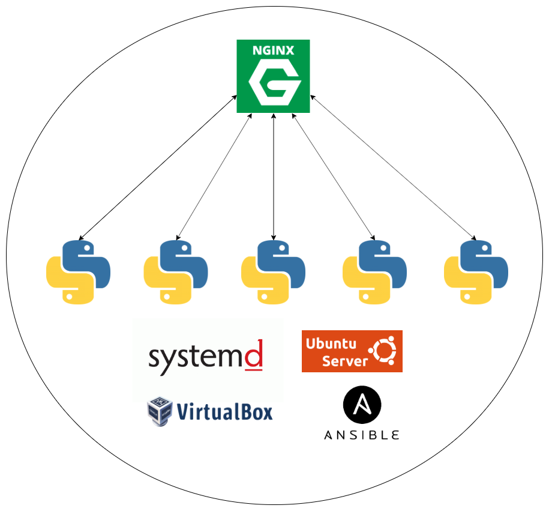

# Vercham

<div dir="rtl">

## اهداف پروژه:

هدف از این پروژه یادگیری ساخت یک نرم افزار ساده ولی مقیاس پذیر میباشد. در این پروژه از زبان Python و فریمورک [Flask](https://flask.palletsprojects.com/en/1.1.x/) استفاده شده است و همچنین در لایه زیرساخت نیز از [Ubuntu Server](https://ubuntu.com/server), [Systemd](https://en.wikipedia.org/wiki/Systemd), [Nginx](https://www.nginx.com/), [Ansible](https://www.ansible.com/) و Virtualbox استفاده شده است.

## توضیحات پروژه:

کاربر یک درخواست به سمت سرور ارسال میکند که در این درخواست یک رشته متنی قرار دارد. سرور وظیفه دارد تعداد کلمات موجود در متن را بشمارد و به ترتیب نزولی نمایش دهد. مثلا در یک سناریو ساده کاربر متن `hello world hello` را ارسال میکند. سرور به این صورت پاسخ میدهد:

</div>

```json
{
    "hello": 2,
    "world": 1
}

```

<div dir="rtl">

به مرور که درخواست ها زیاد میشود با اضافه کردن سرور، توانایی پاسخ به کاربران افزایش میبابد. سرویس نوشته شده به وسیله systemd مدیریت میشود. سرورهای جدید به وسیله Ansible کانفیگ میشود و Nginx بین سرورها درخواست ها را پخش میکند:



> این مستندات به مرور با پیشرفت پروژه تکمیل تر میشود.

</div>